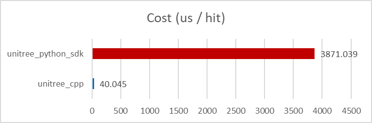

# Unitree Cpp

A lightweight Python binding for **Unitree SDK2**, designed to overcome the performance issues of the official `unitree_sdk2_python` on the **Unitree G1** (Jetson Orin).  

**FREE YOUR UNITREE G1 FROM THE ETHERNET CABLE!**

<div align="center">
<h3><strong>News 🎉: Our Deployment Framework is released at <a href="https://github.com/GDDG08/RoboJuDo">RoboJuDo</a>, try it out!</strong></h3>
<br>
</div>

<div align="center">

</div>

## Inspiration

On Unitree G1, `unitree_sdk2_python` often suffers from serious performance issues, making it difficult to achieve real-time deploy with built-in Jetson pc2. 

Using `unitree_sdk2` directly avoids these performance problems, but C++ development and compilation can be cumbersome and time-consuming. 

This project provides the best of both worlds:  
- **Python interface** for simplicity and quick prototyping  
- **C++ backend** for high-frequency communication and efficiency  

As a result, you can write simple control code in Python, without dealing with the C++ compilation, while still ensuring real-time performance.


We tested the performance of `unitree_cpp` with [AMO](https://github.com/OpenTeleVision/AMO) on G1 pc2. The results are as follows:

<div align="center">

| Implementation      | Cost of control (μs/hit) |
|---------------------|---------------|
| `unitree_sdk2_python`  | 3871.039      |
| `unitree_cpp`          | 40.045        |

</div>

## Installation

### 1. Install Unitree SDK2

Follow the instructions on [Unitree SDK2](https://github.com/unitreerobotics/unitree_sdk2)  
to install the SDK2 on your system.  

**Note:** It is recommended to use the default installation path.  
If you choose a custom path, make sure to update `CMakeLists.txt` accordingly,  
so that the required libraries can be found.


### 2. Install `unitree_cpp` Python Binding

```bash
# switch to your python env
# tested on python>=3.8
pip install .
```

## Getting Started
Please refer to the example file: [`example/unitree_cpp_env.py`](example/unitree_cpp_env.py). 

Test the example with your robot:
- `pip install -r example/requirements.txt`
- change ethernet interface `eth_if` in [`example/config.py`](example/config.py)
- run the example
- your robot should move slowly into default position

This project supports:  
- **Unitree G1**  
- **Dex-3 hand**  
- **Odometry service**  

## C++ Debug (Dex-3)

If you want lower latency than Python, build and run the C++ Dex-3 debug executable.

### Build

Prerequisites (typical on Ubuntu 20.04 / Jetson):
- Unitree SDK2 installed (library + headers)
- CycloneDDS C/C++ (`ddsc`, `ddscxx`) installed
- CMake + a C++17 compiler

Then:

```bash
cmake -S . -B build
cmake --build build --target debug_dex3 -j
```

If you only need the C++ debug executables (and want to skip Python/pybind11 detection):

```bash
cmake -S . -B build -DUNITREE_CPP_BUILD_PYTHON=OFF
cmake --build build --target debug_dex3 -j
```

If you do want to build the Python bindings and CMake picks the wrong Python (e.g. Python 2), install Python 3 dev headers and point CMake to python3:

```bash
sudo apt-get update
sudo apt-get install -y python3 python3-dev python3-pip
cmake -S . -B build -DPython_EXECUTABLE=/usr/bin/python3
```

### Run

```bash
./build/debug_dex3 <net_if> [amplitude] [period_s]
```

Example:

```bash
./build/debug_dex3 eth0 0.3 1.0
```

It will alternately publish open/close poses to `rt/dex3/right/cmd` (left hand is skipped by default).

## Python Debug (Dex-3 right hand)

If you prefer writing control logic in Python (while keeping the DDS communication in C++), run:

```bash
python3 example/debug_dex3_right.py <net_if> [amplitude] [period_s]
```

Example:

```bash
python3 example/debug_dex3_right.py eth0 0.3 1.0
```

## CHANGELOG

**1.0.2**
- Fix: shutdown as damping mode

**1.0.3 [IMPORTANT FIX]**
- Fix control delay, send command immediately after step.
    - this bug could lead to jittering and stability issue, see https://github.com/GDDG08/RoboJuDo/issues/2


## License

CC-BY-4.0
